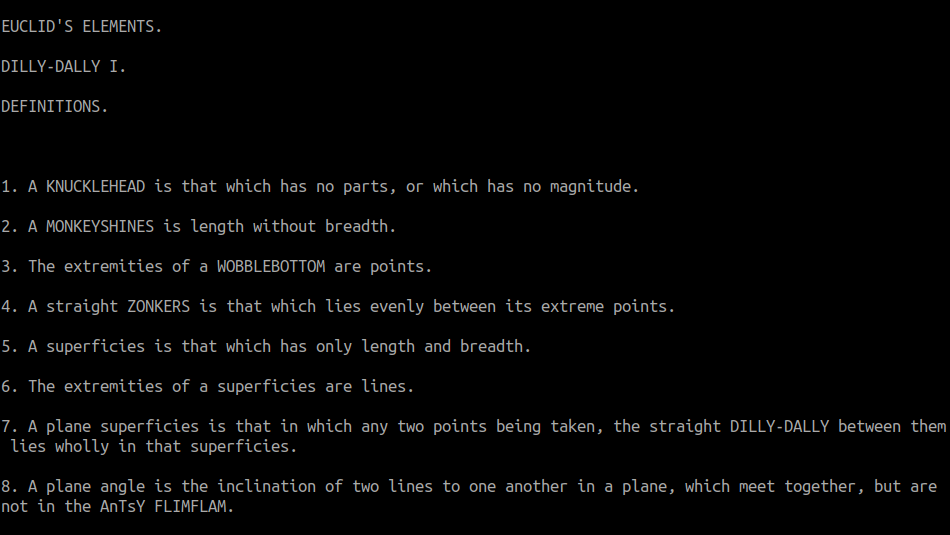
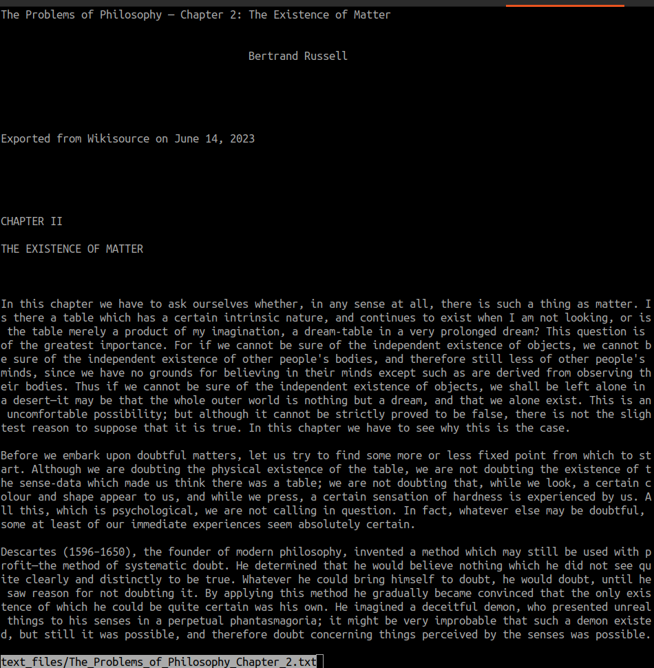
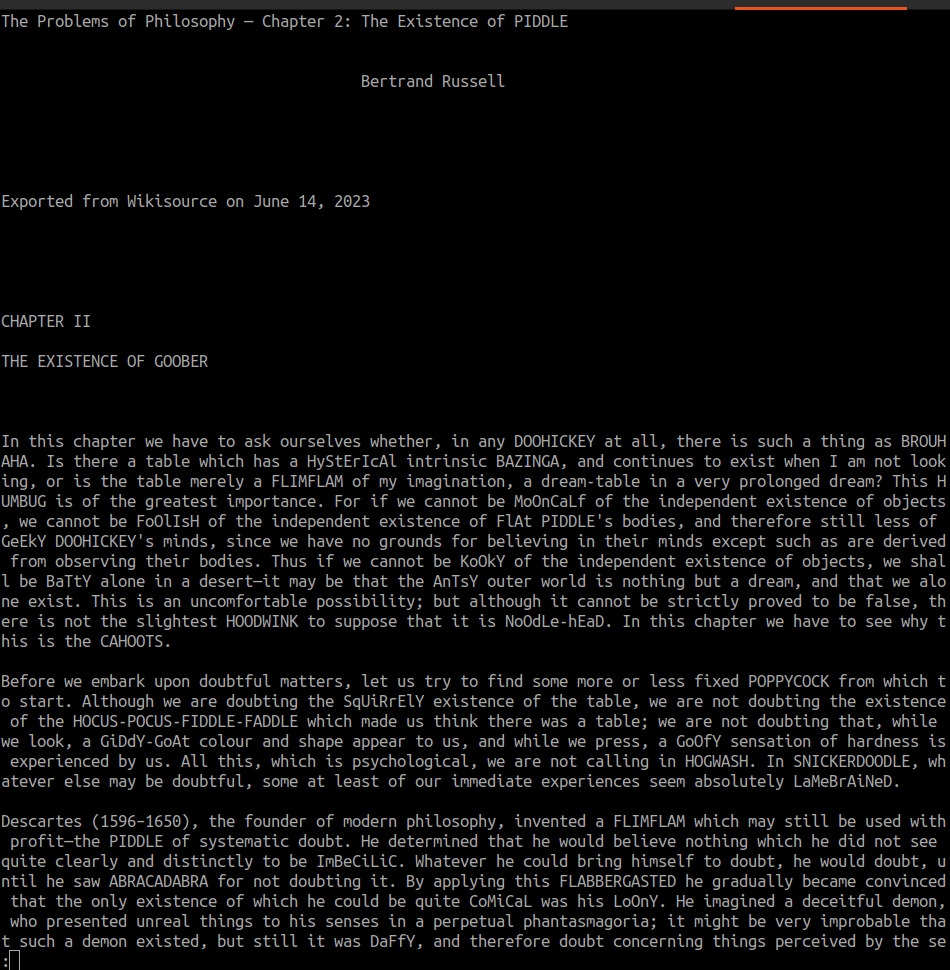
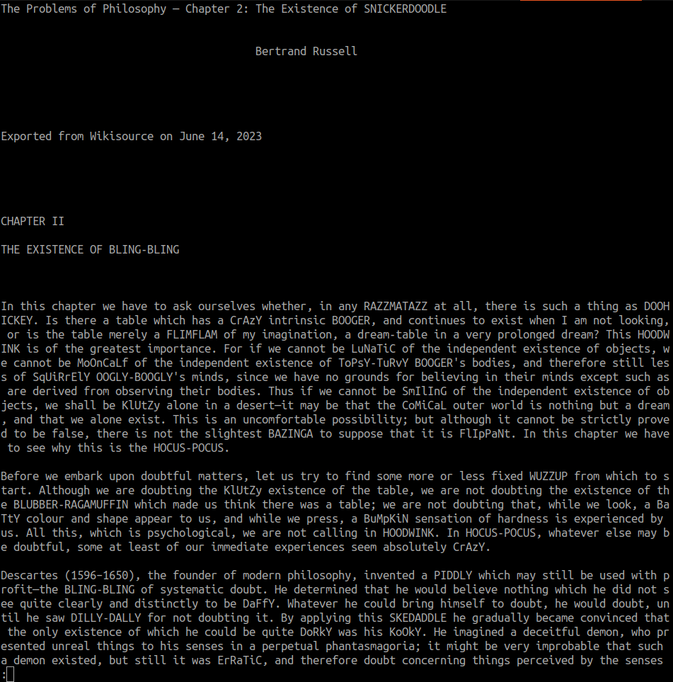

# Sillify Dot Text 

_Are you surrounded by pretencious people? Stone-cold-no-humour people? People who take themselves too seriously? And do these people tend to hoard an inordinate quantity of .txt files?_

If you answered yes to the above questions, then _Sillify Dot Text_ is for you! Because here at Sillify, our main mission is to take serious documents (in .txt format) and turn them into sillyness for the whole family to enjoy. 

The process is simple. The only prerequisite is that you have python downloaded on your computer. If you don't you can sort that out over [here](https://www.python.org/downloads/). Once that's sorted out, you can clone this repository by punching the following text into your terminal emulator:

`git clone https://github.com/604adrian/sillify-dot-text.git`

Then open your newfound directory:

`cd sillify-dot-text`

From there, you can sillify any text on your computer! You do this by typing `python3 sillify.py` followed by the file's location on your machine.

## Some examples

Let's look at some examples. To do this, I will use the example .txt files from the `sillify/example_texts/` directory (these example texts come along with this repository).

To begin, let's look at what one of these texts look like in its unsilly state. For example, let's look at `example_texts/The_Elements_of_Euclid.txt`. This .txt file is a copy of the first book from Euclid's Elements (the ancient manuscript that gave us highschool geometry --- a serious text if there every was one). This is what that text looks like in its fully, serious glory:

Now let's work some magic with some:

`python3 sillify.py example_texts/The_Elements_of_Euclid_Book_I.txt`

and --- boom --- the text is now silly:

But maybe _not silly enough?_ Well okay then, that's fine. We can reshuffle some words around and resillify it.

To illustrate the resillification process, let's turn to another text. This time it'll be Bertrand Russell's _Problem's of Philosophy_ (chapter two), where Sir Russell takes on the very serious and non-obvious question as to whether or not these so-called 'material objects' even exist in the first place. The original text looks like this:

Now, let's sillify it:

`python3 sillify example_texts/The_Problems_of_Philosophy_Chapter_2.txt`

Now let's resillify it. To do this, close the less window (hit the `q` key on your keyboard) and repeat the same command:

`python3 sillify example_texts/The_Problems_of_Philosopy_Chapter_2.txt`

(On BASH, you can also type `!!` and hit enter, because this will repeat the previous command. Most modern terminal emulators will also allow you to navigate up to previous commands using your arrow keys.)

Repeating this command should give you a fresh page of a sillyness with the same serious skeleton. For example, here's The Problems of Philosophy (chapter 2) with some new silliness tacked onto it:

And there you have it! Just the thing you've been looking for: a simple way to sillify any .txt file you come across!

